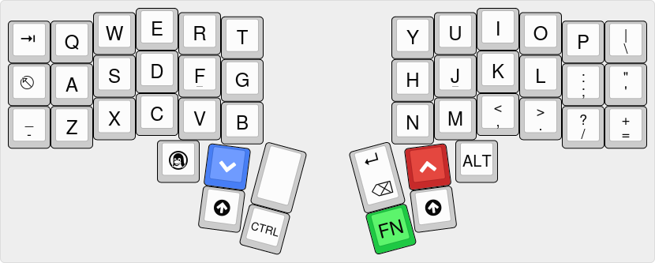

# OtterPaw
A split keyboard based on the likes of the [Corne](https://github.com/foostan/crkbd/) and [Sofle](https://github.com/josefadamcik/SofleKeyboard).

Currently in the design stage, and is being upkept publicly to more easily track process and share with friends and the community.

## Design Goals
First, and most obviously, I want to design a split keyboard. This is mainly 
for the ergonomics, but also the efficiency and portability of this form 
factor. All three of these factors are considered in this design, and come from
a mixture of inspiration from previous designs, as well as my own work-flow and
habits.

Starting with the ergonomics, split keyboards are by default more ergonomic
than traditional monolith keyboards, but even with such a huge jump in 
improvement over the tradition there is still room for improvement. Many before
me have already show that tenting split keyboards increases the ergonomics even
further, and so from the very beginning tenting was considered in the design of
the keyboard. Another design decision graciously borrowed from the giants who
have come before me is the 3x6 layout for the alphas (inspired by the likes of
the Corne). One issue I find split layouts which rely upon layer shifting cause
for me is that I mentally what all of my layer shifting to occur from the 
thumb, and this holds for the traditional "shift" layer as well. As such, I knew
I would need a larger, more centralized thumb cluster than provided by the likes
of the Corne or Sofle.

This leads to the efficiency aspect of my design. I use a very keyboard assisted
desktop environment based on [i3](https://i3wm.org/), and as such I frequently
use a combination of keyboard and mouse wheel for my navigation. Focusing on the
keyboard part of the navigation, I knew that accessible key-combinations were
something I needed to consider in the design. Moving from a 95% keyboard to a 
~50% keyboard like the Sofle was much less of an adjustment than I anticipated 
due to the versatility of layers, however when it came to i3 navigation 
shortcuts this did not hold up. I imagine that with moving to a 40% this will 
become especially evident. To reconcile this, I have designed multiple of the
modifier keys used for navigation key-combos to be easily pressed together with
one thumb. This may not work as well as I'd hope, but there's no harm in
experimentation. Worst case scenario, adding in the 'FN' layer opens an entire
layer up which can be used for i3 control, albeit with new keybinds which I am
not already familiar with. Returning to the mouse wheel, one desire I have had
has been to add either a basic 
[trackpoint](https://github.com/zmkfirmware/zmk/pull/1751) or even
[trackball](https://shop.pimoroni.com/products/trackball-breakout?variant=27672765038675). There area lot of caveats relating to this that I will
cover in [their own section](#pointing-device), but for now I mention that
whatever I choose will sit on the right half of the split directly above the
thumb key and below the OLED screen.

This finally brings things back to the portability of the keyboard. The 40% and 
split factors of the keyboard already enhance the portability aspect 
significantly, however they introduce one problem: side connect via a TRRS
cable. To reconcile this, and further to eliminate the cable limitations in
general, I have opted for a Bluetooth enabled board with the 
[nice!nano](https://nicekeyboards.com/nice-nano/). Further, the 
[nice!view](https://nicekeyboards.com/nice-view) OLED will be used to help with
power savings. To accompany this, I will use a 
[1000 mAh LiPo battery](https://www.canadarobotix.com/products/588) which should
allow for a very long charge time, compensating for the possibly above average
power draw of the trackpoint or trackball.

## Layout

The layout can be viewed [here](http://www.keyboard-layout-editor.com/##@_name=OtterPaw%20v0.1&author=https%2F:%2F%2F%2F%2Fgithub.com%2F%2Fbaf57&notes=forked%20from%20sams96&plate:false&pcb:false%3B&@_x:3&a:7&fa@:9%3B%3B&=E&_x:7%3B&=I%3B&@_y:-0.9&x:2%3B&=W%3B&@_y:-1&x:4%3B&=R&_x:5%3B&=U&_x:1%3B&=O%3B&@_y:-0.9000000000000001&x:5%3B&=T&_x:3%3B&=Y%3B&@_y:-0.8999999999999999%3B&=%3Ci%20class%2F='kb%20kb-Line-End'%3E%3C%2F%2Fi%3E&=Q&_x:11%3B&=P&_a:5&fa@:6&:6&:0&:0&:0&:0&:0%3B%3B&=%7C%0A%5C%3B&@_y:-0.30000000000000004&x:3&a:7&fa@:9%3B%3B&=D&_x:7%3B&=K%3B&@_y:-0.8999999999999999&x:2%3B&=S&_x:1&n:true%3B&=F&_x:5&n:true%3B&=J&_x:1%3B&=L%3B&@_y:-0.9000000000000001&x:5%3B&=G&_x:3%3B&=H%3B&@_y:-0.9000000000000001%3B&=%3Ci%20class%2F='kb%20kb-Unicode-Escape-1'%3E%3C%2F%2Fi%3E&=A&_x:11&a:5&fa@:6&:6%3B%3B&=%2F:%0A%2F%3B&=%22%0A'%3B&@_y:-0.2999999999999998&x:3&a:7&fa@:9%3B%3B&=C&_x:7&a:5&fa@:6&:6%3B%3B&=%3C%0A,%3B&@_y:-0.8999999999999999&x:2&a:7&fa@:9%3B%3B&=X&_x:1%3B&=V&_x:5%3B&=M&_x:1&a:5&fa@:6&:6%3B%3B&=%3E%0A.%3B&@_y:-0.8999999999999999&x:5&a:7&fa@:9%3B%3B&=B&_x:3%3B&=N%3B&@_y:-0.9000000000000004&a:5&fa@:6&:6%3B%3B&=%2F_%0A-&_a:7&fa@:9%3B%3B&=Z&_x:11&a:5&fa@:6&:6%3B%3B&=%3F%0A%2F%2F&=+%0A%2F=%3B&@_y:-0.19999999999999973&x:3.5&a:7&fa@:9%3B%3B&=%3Ci%20class%2F='kb%20kb-logo-linux-tux-ibm'%3E%3C%2F%2Fi%3E&_x:6&fa@:7%3B%3B&=ALT%3B&@_r:7.5&rx:4.5&ry:4.1&y:-0.9499999999999997&x:0.09999999999999964&c=%23477ef5&t=%23ffffff&fa@:9%3B%3B&=%3Ci%20class%2F='fa%20fa-chevron-down'%3E%3C%2F%2Fi%3E%3B&@_x:0.09999999999999964&c=%23cccccc&t=%23000000%3B&=%3Ci%20class%2F='fa%20fa-arrow-circle-up'%3E%3C%2F%2Fi%3E%3B&@_r:15&y:-2.4000000000000004&x:1.25&h:1.5%3B&=%3B&@_y:0.5&x:1.25&fa@:4%3B%3B&=CTRL%3B&@_r:-15&rx:10.5&y:-1.3499999999999996&x:-2.25&a:5&fa@:9&:9&:0&:0&:0&:0&:0%3B&h:1.5%3B&=%3Ci%20class%2F='kb%20kb-Return-2'%3E%3C%2F%2Fi%3E%0A%3Ci%20class%2F='kb%20kb-Unicode-BackSpace-DeleteLeft-Big'%3E%3C%2F%2Fi%3E%3B&@_y:0.5&x:-2.25&c=%231ec944&a:7%3B&=FN%3B&@_r:-7.5&y:-2.1&x:-1.0999999999999996&c=%23c72a2a&t=%23ffffff%3B&=%3Ci%20class%2F='fa%20fa-chevron-up'%3E%3C%2F%2Fi%3E%3B&@_x:-1.0999999999999996&c=%23cccccc&t=%23000000%3B&=%3Ci%20class%2F='fa%20fa-arrow-circle-up'%3E%3C%2F%2Fi%3E). This a very early version of this layout and is subject to significant change.

## Pointing Device
There are two different pointing devices which I have considered using in this
keyboard: the trackpoint, and the trackball. There are pros and cons to each,
which I will outline here. 

### Trackpoint

| Pros          | Cons         |
|---------------|--------------|
| Familiar      | Hard to source |
| Low-ish power draw | Not completely implemented in ZMK |
|  | [Minimal documentation](https://github.com/zmkfirmware/zmk/pull/1751) |

### Trackball

| Pros | Cons |
|------|------|
| Easy to source | Bad power draw (maybe?)|
| [ZMK PR exists with documentation](https://github.com/zmkfirmware/zmk/pull/961) | Large |

I will be experimenting with both of these devices in order to determine which
of the two I will prefer. I would probably use the trackball if it wasn't for
the power draw issues as it is easier to source and seems to have better 
documentation. I do however have more familiarity with the trackpoint and also 
the power draw potentially gives a big benefit over the trackball. Power draw
experimentation will determine which I use in the end.